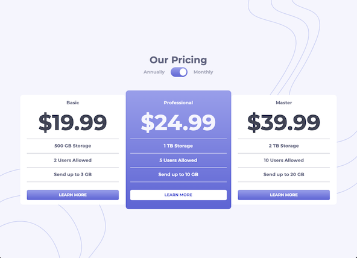
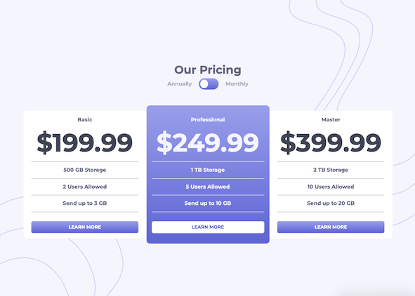
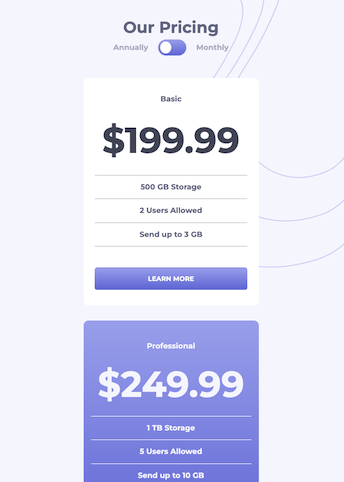

# Frontend Mentor - Pricing component with toggle solution

This is a solution to the [Pricing component with toggle challenge on Frontend Mentor](https://www.frontendmentor.io/challenges/pricing-component-with-toggle-8vPwRMIC). Frontend Mentor challenges help you improve your coding skills by building realistic projects.

## Table of contents

- [Frontend Mentor - Pricing component with toggle solution](#frontend-mentor---pricing-component-with-toggle-solution)
  - [Table of contents](#table-of-contents)
  - [Overview](#overview)
    - [The challenge](#the-challenge)
    - [Screenshot](#screenshot)
    - [Links](#links)
  - [My process](#my-process)
    - [Built with](#built-with)
    - [What I learned](#what-i-learned)
  - [Author](#author)

## Overview

### The challenge

Users should be able to:

- View the optimal layout for the component depending on their device's screen size
- Control the toggle with both their mouse/trackpad and their keyboard
- **Bonus**: Complete the challenge with just HTML and CSS

### Screenshot

### Links

- Solution URL: [EricWink GitHub](https://github.com/ericwink/FEM-Pricing-Component-With-Toggle)
- Live Site URL: [Live Site Demo](https://fem-pricing-component-with-toggle.netlify.app/)

## My process

### Built with

- Semantic HTML5 markup
- CSS custom properties
- Flexbox
- [React](https://reactjs.org/)

### What I learned

This project really helped me to solidify my workflow for setting up layouts correctly and optimizing my time.

## Author

- Website - [EricWink GitHub](https://github.com/ericwink)
- Frontend Mentor - [@ericwink](https://www.frontendmentor.io/profile/ericwink)
